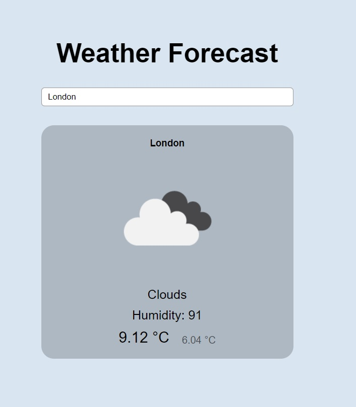

### Weather Forecast App

This project is a simple weather app that allows users to search for the weather of a specific location. It utilizes the OpenWeatherMap API to retrieve weather data and displays it to the user.

api_connection.js
This script contains the function makeWeatherApiCall responsible for making API calls to retrieve weather data based on the user's location input.

displayWeather.js
This script contains the displayWeather function, which takes weather data as input and updates the UI to display the weather information.

app.js
This script handles user interactions and integrates the API call and display functions.

Usage
1. Add API key into let keyAPI = ''; in 'api_connection.js'
2. Enter the desired location in the search input field.
3. Press Enter or click the search button.
4. The weather information for the specified location will be displayed.